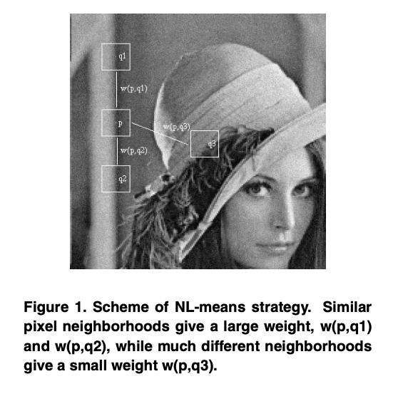
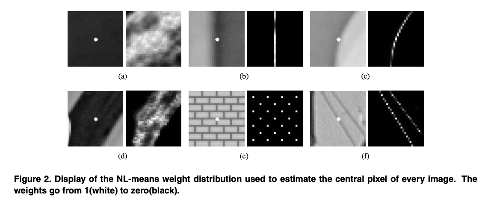

# Non-local Mean Algorithm

[TOC]

## Image Denoising

### Noise In Image

* All signal processing devices have traits that make them susceptible to noise
* Images taken with both digital cameras and conventional film cameras will pick up noise from a variety of sources like by a device's mechanism or signal processing algorithms
* Noise can be random or white noise with frequency distribution or frequency dependent noise.
* **Noise reduction** is the process of removing noise from a signal
* Noise reduction algorithms tend to alter signals to a greater or lesser degree

### Noise Type

#### [Consisitency]

* the noise at different pixels can be
  * **correlated**
  * **uncorrelated**
    * noise values at different pixels are modeled as being [independent and identically distributed](https://en.wikipedia.org/wiki/Independent_and_identically_distributed)

#### 1. Salt and Pepper Noise
* == sparse light and dark disturbances
  * the pixels in the image are very different in color or intensity from their surrounding pixels
  * the defining characteristic is that the value of a noisy pixel bears no relation to the color of surrounding pixels.
  * Generally this type of noise will only affect a small number of image pixels
  * When viewed, the image contains dark and white dots, hence the term salt and pepper noise
  * example
    *  flecks of dust inside the camera
    * overheated or faulty [CCD](https://en.wikipedia.org/wiki/Charge-coupled_device) elements
#### 2. Gaussian Noise
* each pixel in the image will be changed from its original value by a (usually) small amount.

* A histogram, a plot of the amount of distortion of a pixel value against the frequency with which it occurs, shows a [normal distribution](https://en.wikipedia.org/wiki/Normal_distribution) of noise. i.e. the values that the noise can take on are Gaussian-distributed.

  * The probability density function {\displaystyle p} of a Gaussian random variable {\displaystyle z} is given by:

    ​                                         $\Huge{p_{G}(z)=\frac{1}{\sigma \sqrt{2 \pi}} e^{-\frac{(z-\mu)^{2}}{2 \sigma^{2}}}}$

  * where ${\displaystyle z}$ represents the grey level, ${\displaystyle \mu}$ the [mean](https://en.wikipedia.org/wiki/Mean) value and ${\displaystyle \sigma }$ the [standard deviation](https://en.wikipedia.org/wiki/Standard_deviation).

* the Gaussian (normal) distribution is usually a good model, due to the [central limit theorem](https://en.wikipedia.org/wiki/Central_limit_theorem) that says that the sum of different noises tends to approach a Gaussian distribution

* arise during acquisition e.g. [sensor noise](https://en.wikipedia.org/wiki/Sensor_noise) caused by poor illumination and/or high temperature, and/or transmission e.g. [electronic circuit noise](https://en.wikipedia.org/wiki/Circuit_noise_level)

* special case:  *White Gaussian noise*

  *  the values at any pair of times are uncorrelated

* can be reduced using a [spatial filter](https://en.wikipedia.org/wiki/Spatial_filter), though when smoothing an image, an undesirable outcome may result in the blurring of fine-scaled image edges and details because they also correspond to blocked high frequencies

### Goal

* recover the original image from a noisy measurement

  ​                                      $\Huge{v(i) = u(i) + n(i)}$

* where $\large{v(i}) \to$ observed value,    $\large{u(i}) \to$ "true" value,  $\large{n(i}) \to$ noise perturbation at a pixel $\large{i}$

* the best simple way to model the effect of noise on a digital image

  *  $\large{n(i})$ = gaussian white noise [ so that  $\large{n(i})$ = i.i.d. gaussian values with zero mean and variance $\sigma^2$ ]
  
## Denoising Algorithm

### Pre-requesitte

 In selecting a noise reduction algorithm, one must weigh several factors:

- the available computer power and time available
  *  a digital camera must apply noise reduction in a fraction of a second using a tiny onboard CPU, while a desktop computer has much more power and time
- whether sacrificing some real detail is acceptable if it allows more noise to be removed 
  * how aggressively to decide whether variations in the image are noise or not
- the characteristics of the noise and the detail in the image, to better make those decisions

### Basic Remark Of any Method

* **Denoising is archived by averaging**

### Measures of Efficiency of the Method

* Method Noise
  *  $\to$ 0
  * must look like a noise even with non noisy images
  * should contain as little structure as possible

### Smoothing Method Formula

* a denoising method $\large{D_h}$ can be defined as:

​                                              $\Huge{v = D_hv + n(D_h, v)}$ 

*  $\large{v} \to$ noisy image,    $\large{h}\to$ filtering parameter $\propto$ standard deviation of noise,  $\large{n()} \to$ noise perturbation
* optimality
  * $\large{D_hv}$  smoother than $\large{v}$
  * $\large{n(D_h, v)}$  = the realization of a white noise

### Method Noise

* image defference between

  * the original (always slightly noisy) image $\large{u}$ 
  * its denoised version

* Formula

  ​                                              $\Huge{MethodNoise = u - D_hu}$ 

  * image $\large{u}$
  * $\large{D_h} \to$ a denoising operator $\propto$ a filtering parameter $\large{h}$

### Non-local Mean

* non-local means filtering takes a mean of all pixels in the image, weighted by how similar these pixels are to the target pixel. 

* In particular, the amount of weighting for a pixel is based on the degree of similarity between a small patch centered on that pixel and the small patch centered on the pixel being de-noised.

* non-local means adds "method noise" (i.e. error in the denoising process) which looks more like [white noise](https://en.wikipedia.org/wiki/White_noise), which is desirable because it is typically less disturbing in the denoised product.

* This results in much greater post-filtering clarity, and less loss of detail in the image compared with local mean algorithms. 

* formula

  $\Huge{N L[u](x)=\frac{1}{C(x)} \int_{\Omega} e^{-\frac{\left(G_{a} *|u(x+.)-u(y+.)|^{2}\right)(0)}{h^{2}}} u(y) d y}$

  * normalizing constant $\LARGE{C(x)=\int_{\Omega} e^{-\frac{\left(G_{a} *|u(x+.)-u(y+.)|^{2}\right)(0)}{h^{2}}}dz}$      
  * Gaussian kernel $\large{G_a}$ 
  * filtering parameter $\large{h}$ 
  * $\large{x} \in \Omega$ 

* **semantic**

  * the denoised value at pixel $\large{x}$ is a mean of the values of all points whose
    *  gaussian neighborhood looks like the neighborhood of such pixel $\large{x}$

* main difference w.r.t. local filters or frequency domain filters

  * the sysmatic use of all possible self-predictions the image can provide

## Local Smoothing Filters Algorithm

* i.e.  Classical Local Smoothing Filters

### Gaussian Filtering

* the image isotropic linear filtering 

* boils down to the [convolution](https://en.wikipedia.org/wiki/Convolution) of the image

*  by a linear symmetric kernel

  * Gaussian Kernel

    ​                           $\Huge{\mathbf{x} \rightarrow G_{h}(\mathbf{x})=\frac{1}{\left(4 \pi h^{2}\right)} e^{-\frac{|\mathbf{x}|^{2}}{4 h^{2}}}}$

    * $\large{G_h}$ has standard deviation $\large{h}$

* Method Noise of the convolution with a gaussian kernel $G_h$ 

  ​                        $\Huge{u-G_{h} * u=-h^{2} \Delta u+o\left(h^{2}\right)}$

  * when $\large{h}$  small enough
  
* Trade-off

  1. Method Noise $=$ 0 in harmonic parts of the image
  2. Method Noise $\to \infty$ near edges or texture  
     * where [Laplacian](https://en.wikipedia.org/wiki/Laplace_operator) cannot be small

* Performence ( for all Gaussian Convolution )

  * optimal in flat parts of the image
  * blurred around edges and texture

### Anisotropic Filtering

* attempt to avoid the blurring effect of the Gaussian

* by convolving the image $\large{u}$ at pixel $\large{\mathbf{x}}$ ONLY in the direction Y

* Y orthogonal to $\large{D_u(x)}$

* formula

  ​      $\Huge{A F_{h} u(\mathbf{x})=\int G_{h}(t) u\left(\mathbf{x}+t \frac{D u(\mathbf{x})^{\perp}}{|D u(\mathbf{x})|}\right) d t}$

  * $\large{\forall \mathbf{x} }$ s.t. $\large{D_u(\mathbf{x})\neq 0 }$  $\large{\land}$ $\large{(x, y)^{\perp}=(-y, x)}$
  * $\large{G_h} \to$ 1D Gauss function  with variance $\large{h^2}$

* Method Noise of the anisotropic filtering $\large{AF_h}$

  * Pre-assumption = the original image $\large{u}$ is *twice continuously differentiable ( i.e. $\large{C^2}$ )*   at $\large{\mathbf{x}}$ 

    ​                         $\Huge{u(\boldsymbol{x})-A F_{h} u(\boldsymbol{x}) }$

    ​               $\Huge{=-\frac{1}{2} h^{2}|D u| \operatorname{curv}(u)(\boldsymbol{x})+o\left(h^{2}\right)}$

  * $\large{curve(u)(\mathbf{x})}\to$ [Curvature](https://en.wikipedia.org/wiki/Curvature) 

    *  the signed inverse of the radius of curvature of the level line passing by **x**

* trade-offs

  1. Method Noise = 0 whenever $\large{u}$ behaves  locally like a straight line
  2. Method Noise $\to \infty$ in curved edges/texture 
     * where the curvature and gradient operators take high values

* Performence

  * the straight edges are well restored
  *  flat and textured regions are degraded

### Total Vairation Minimization

* given a noisy image $\large{v(\mathbf{x})}$

* recover the original image $\large{u(\mathbf{x})}$

* as the solution of the minimization problem

* the minimum of the below minimization problem exists and is unique

* formula

  $\Huge{T V F_{\lambda}(v)=\arg \min _{u} T V(u)+\lambda \int|v(\mathbf{x})-u(\mathbf{x})|^{2} d \mathbf{x}}$

  * $\large{TV(u)} \to$ the total vairation of $\large{u}$
  *  a given Lagrange multiplier $\large{\lambda}$
    * related to the noise statistics
    * controls the degree of filtering of the obtained solution

* Method Noise of the total vairation minimuzation filtering $\large{TVF_{\lambda}(u)}$

  $\Huge{u(\boldsymbol{x})-T V F_{\lambda}(u)(\boldsymbol{x})=-\frac{1}{2 \lambda} \operatorname{curv}\left(T V F_{\lambda}(u)\right)(\boldsymbol{x})}$

  * $\large{curve(u)(\mathbf{x})}\to$ Curvature 
    *  the signed inverse of the radius of curvature of the level line passing by **x**

* trade-offs

  1. straight edges are maintained because of their small curvature
  2. details and tex- ture can be over smoothed if λ is too small

### Neighborhood Filtering

* restore a pixel by taking an average 

* of the values of neighboring pixels 

* with a similar grey level value

* **Yaroslavsky Neighborhood Filtering**

  * average pixels belonging to a fixed spatial neighborhood $\large{B_{\rho}(\mathbf{x})}$

  * formula

    $\Huge{Y N F_{h, \rho} u(\mathbf{x})=\frac{1}{C(\mathbf{x})} \int_{B_{\rho}(\mathbf{x})} u(\mathbf{y}) e^{-\frac{|u(\mathbf{y})-u(\mathbf{x})|^{2}}{h^{2}}} d \mathbf{y}}$

    * $\large{\mathbf{x} \in \Omega}$
    * normalization factor $\Large{C(\mathbf{x})=\int_{B_{\rho}(\mathbf{x})} e^{-\frac{|u(\mathbf{y})-u(\mathbf{x})|^{2}}{h^{2}}} d \mathbf{y}}$  
    * filtering parameter $\large{h}$
  
* **SUSAN filter / Bilateral filter**

  * weigh the distance to the reference pixel **x**

  * formula

    $\Huge{S N F_{h, \rho} u(\mathbf{x})=\frac{1}{C(\mathbf{x})} \int_{\Omega} u(\mathbf{y}) e^{-\frac{|y-\mathbf{x}|^{2}}{\rho^{2}}} e^{-\frac{|u(\mathbf{y})-u(\mathbf{x})|^{2}}{h^{2}}} d \mathbf{y}}$

    * $\large{\mathbf{x} \in \Omega}$
    * normalization factor $\Large{C(\mathbf{x})=\int_{\Omega} e^{-\frac{|\mathbf{y}-\mathbf{x}|^{2}}{\rho^{2}}} e^{-\frac{|u(\mathbf{y})-u(\mathbf{x})|^{2}}{h^{2}}} d \mathbf{y}}$  
    * sptial filtering parameter $\large{\rho}$
  
* trade-off

  1. the algorithm does not blur the edges
     * there is no difference between YNF and SNF
       * If the grey level difference between two regions is larger than $\large{h}$, both algorithms compute averages of pixels belonging to the same region as the reference pixel
  2. comparing only grey level values in a single pixel is not so robust when these values are noisy

## NL-means Algorithm

### Denotion

* Given a discrete noisy image $\large{v=\{v(i) | i \in I\}}$

* the estimated value $\large{N L[v](i)}$ = a weighted average of all the pixels in the image

  ​                              $\Huge{N L[v](i)=\sum_{j \in I} w(i, j) v(j)}$

* where the family of weights $\large{\{w(i, j)\}_{j}}$ depend on 

  * the ==**similarity**== between the pixels i and j
    * depend on the intensity gray level vectors $\large{v\left(\mathcal{N}_{i}\right)}$ and $\large{v\left(\mathcal{N}_{j}\right)}$ 
  * satisfy the usual conditions $\large{0 \leq w(i, j) \leq 1 \text { and } \sum_{j} w(i, j)=1}$

#### Similarity of Weight

* denotion
  * $\large{\mathcal{N}_{k}}$ = a square neighbothood of fixed size and centered at a pixel $\large{k}$ 
  * $\large{v\left(\mathcal{N}_{i}\right)}$ and $\large{v\left(\mathcal{N}_{j}\right)}$ = the intensity gray level vectors 
  * $\large{E(i, j)} \to$  a decreasing function of the weighted Euclidean distance to the noisy neighborhoods
    * formula
      * $\large{a>0} \to$ the standard deviation of the Gaussian kernel                               $\Huge{E(i, j)=\left\|v\left(\mathcal{N}_{i}\right)-v\left(\mathcal{N}_{j}\right)\right\|_{2, a}^{2}}$
  
* robustness
      * in expectation the Euclidean distance conserves the order of the similarity between pixels  $\Huge{E(i,j)=\left\|u\left(\mathcal{N}_{i}\right)-u\left(\mathcal{N}_{j}\right)\right\|_{2, a}^{2}+2 \sigma^{2}}$
  
* definition

  * the pixels with a similar grey level neighborhood to $\large{v\left(\mathcal{N}_{i}\right)}$ have largert weights in the average

* formula

  $\Huge{w(i, j)=\frac{1}{Z(i)} e^{-\frac{E(i, j)}{h^{2}}}=\frac{1}{Z(i)} e^{-\frac{\left\|v\left(\mathcal{N}_{i}\right)-v\left(\mathcal{N}_{j}\right)\right\|_{2, a}^{2}}{h^{2}}}}$

  * the normalizing constant $\Large{Z(i)=\sum_{j} e^{-\frac{E(i, j)}{h^{2}}}}$
  * the parameter $\large{h} \to$ a degree of filtering
    * control the [decay](https://mathworld.wolfram.com/ExponentialDecay.html) of the exponential function, i.e., the [decay](https://mathworld.wolfram.com/ExponentialDecay.html) of the weights as a function of the Euclidean distances

#### Scheme of NL-means strategy

* a more robust comparision than the neighborhood filters since NL-means

  1.  compare the grey level in a single point
  2. have the geometrical configuration  in a whole neighborhood

* example[Figure 1]

  * **Similar pixel neighborhoods give a large weight, w(p,q1) and w(p,q2), while much different neighborhoods give a small weight w(p,q3)**

  * the pixel $q3$ has the same grey level value of pixel $p$
  * but the neighborhoods are much different
  * therefore the weight $\large{w(p, q3)}$ is nearly zero

### NL-means consistency

* Under stationarity assumptions, for a pixel $\large{i}$, once observed a neighborhood of it $\Longrightarrow$ 
  * the NL- means algorithm converges to the conditional expectation of $\large{i}$
* In this case, the stationarity conditions amount to say that
  * as the size of the image grows  $\Longrightarrow$  we can find many similar patches for all the details of the image

#### Pre-assumption

* Let $V$ be a random field 

* the noisy image $\large{v}$ is a realization of $V$ 

*  Let $Z$ denote the sequence of random variables

  *  $Z_{i}=\left\{Y_{i}, X_{i}\right\}$ where

    *   $Y_{i}=V(i)$ is real valued 

    * $X_{i}=V\left(\mathcal{N}_{i} \backslash\{i\}\right)$ is $\mathbb{R}^{p}$ valued
#### Denotion
* The NL-means $\large{r(i)}$ is an estimator of the conditional expectation $\large{E[p]}$

  ​                                       $\Huge{r(i)=E\left[Y_{i} |\right.\left.X_{i}=v\left(\mathcal{N}_{i} \backslash\{i\}\right)\right]}$

#### Conditional expectation theorem[12]

* **denotion**
  * Let $Z = \left\{V(i), V\left(\mathcal{N}_{i} \backslash\{i\}\right)\right\}$ for $i=1,2, \ldots$ be a strictly stationary and mixing process
  *  Let $N L_{n}$ denote the NL-means algorithm applied to the sequence $Z_{n}=$ $\left.\left\{V(i), V\left(\mathcal{N}_{i}\right)\{i\}\right)\right\}_{i=1}^{n}$
  * Then  (  [a.s.](https://math.stackexchange.com/questions/241337/what-is-the-meaning-of-a-s)  for $\large{ j \in\{1, \ldots, n\}}$ )

​                                                      $\Huge{\left|N L_{n}(j)-r(j)\right| \rightarrow 0 \quad}$

* **Contribution to NL-means**
  *  theorem shows that NL-means algorithm
    * corrects the noisy image 
    * rather than trying to separate the noise (oscillatory) from the true image (smooth)

#### Assumption for an additive white noise model[9]

* **Contirbution to NL-means**

  * theorem shows that
    *   the conditional expectation is the function of $V\left(\mathcal{N}_{i} \backslash\{i\}\right)$ that 
      * minimizes the mean square error with the true image $u$

* **denotion**

  * Let $V, U, N$ be random fields $\in$ $I$ s.t. $V = U + N$

  * $N$ is a signal independent white noise

  * $E[p]$ is a conditional expectation, i.e., expected random variable

  * Then

    1. $\huge{E\left[V(i) | X_{i}=x\right]=E\left[U(i) | X_{i}=x\right]: \forall i \in I
       \land x \in \mathbb{R}^{p}}$

    2.  $\huge{E\left[U(i) | V\left(\mathcal{N}_{i} \backslash\{i\}\right)\right]}$ 

       $\huge{=}$ the function of $\huge{V\left(\mathcal{N}_{i} \backslash\{i\}\right)}$ that minimizes the mean square error

       $\huge{=\min _{g} E\left[U(i)-g\left(V\left(\mathcal{N}_{i} \backslash\{i\}\right)\right)\right]^{2}}$

## Comparision With Local Smoothing Filters

### Global NL-mean Varible

1. restrict the search of similar windows in a larger search window of size $S \times S$ pixels (Gaussian Pyramid?)
2. fix the search window of 21 $\times$ 21 pixels
3. fix the similarity square neighborhood $\large{\mathcal{N}_{i}}$ of 7 $\times$ 7 pixels
4. the filtering parameter $\large{h}$ has been fiexed to $\large{10 * \sigma} $ when a noise of standard deviation $\large{\sigma}$ is added

#### Discussion For Performance of NL-mean

* **[Figure2] Display of the NL-means weight distribution used to estimate the central pixel of every image. The weights go from 1(white) to zero(black)** 

1. $7 \times 7$ similarity windows has shown to be
   *  large enough to be robust to noise
   *  small enough to take care of details and fine structure
2. Due to the fast decay of the exponential kernel
   * large Euclidean distances lead to weights $\to 0$
   * acting as an automatic threshold

#### Time Complexity of NL-mean

* if $\large{N^2}$ is the number of pixels of the image
* then the final complexity of the algorithm is about $\large{49 \times 441 \times N^2}$

### Criteria1: Method Noise

* The method noise helps us to understand the performance and limitations of the denoising algorithms
* since removed details or texture have a large method noise

#### Visual Experiment [Figure 4]

* the parameter $h$ is been fixed to remove a noise of standard deviation 2.5
* figure displays the method noise, i.e., the difference $u − D_h(u)$ , for the standard image Lena

#### Robustness For NL-means

* the NL-means method noise does not present any noticeable geometrical structures
  * Figure 2 explains this property
  * since it shows how the NL-means algorithm chooses a weighting configuration
  *  adapted to the local and non local geometry of the image

#### Computation Proof

* defined in the section 2

### Criteria2: Visual Quality of the restored image

* The human eye is the only one able to decide
  * if the quality of the image has been improved by the denoising method
* All experiments have been simulated by
  *  adding a gaussian white noise of standard deviation $\large{\sigma}$ to the true image
* The objective is to compare the visual quality of
  *  the restored images [Gaussian/Laplacian Pyrimid]
  * the non presence of artifacts
  * the correct reconstruction of edges, texture and details

#### Robustness For NL-means

*  the most favorable case = the textured or periodic case

  * it is due to the nature of the algorithm

  * for every pixel i, we can find a large set of samples with a very similar configuration

#### Visual Experiment

* Figure 2 e) 
  * example of the weight distribution of the NL-means algorithm **for a periodic image**
* Figure 3
  * compares the performance of the NL-means and local smoothing filters **for a natural texture**

#### Comparision of the restored images and Natural images

* Natural images  have enough redundancy to be restored by NL-means
*  Figure 2 (a)
  * Flat zones present a huge number of similar configurations lying inside the same object
* Figure 2 (b) + (c)
  * Straight or curved edges have a complete line of pixels with similar configurations
* Figure 2 (f)
  * Natural images allow us to find many similar configurations in far away pixels
* Figure 5 natural image ( Compared with Figure 4 i.e. method noise of image)
  * The blurred or degraded structures of the restored images coincide with the noticeable structures of its method noise

### Criteria3: Mean Square Error 

* aka the Euclidean difference between the restored and true 
* display in Table 1

#### Measurement
*  A smaller mean square error = the estimate is closer to the original image

#### Trade-off

* pros
  * This numerical measurement is the most objective one, since it does not rely on any visual interpretation. 
* cons 
  * this error is not computable in a real problem
  * a small mean square error does not assure a high visual quality
  * so all above discussed criteria seem necessary to compare the performance of algorithms

## Figure Table

### Figure 1

### Figure 2

### Figure 3

### Figure 4

### Figure 5

### Table 1

